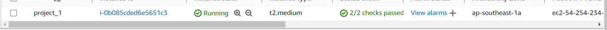
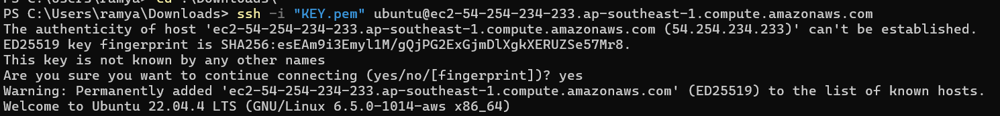
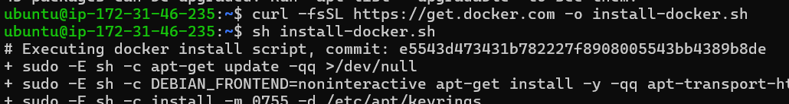
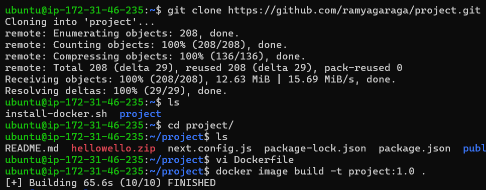
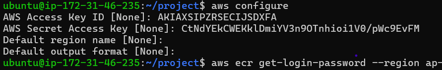
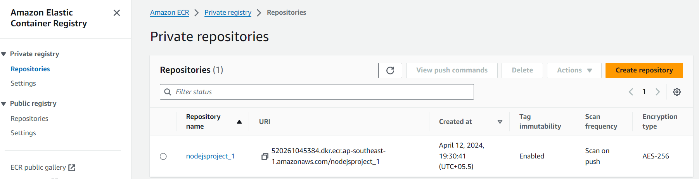
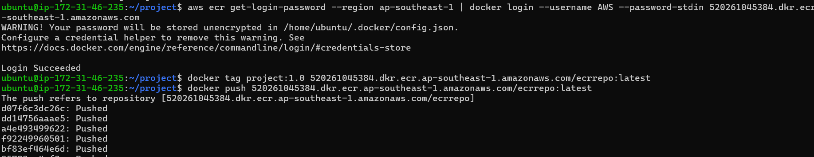
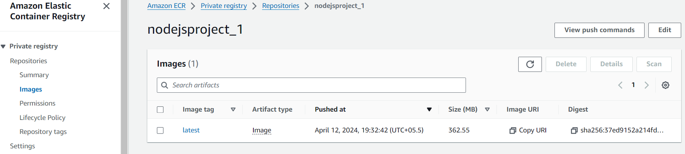
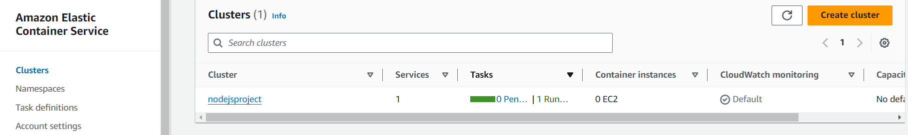
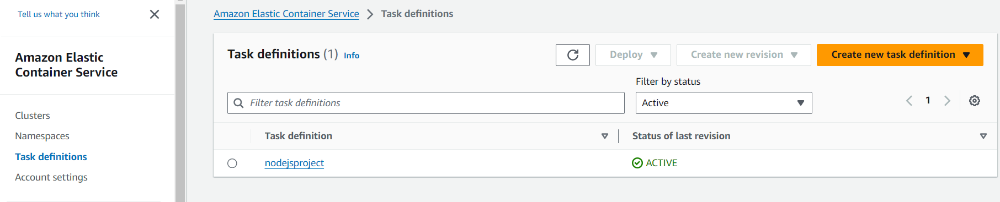

# **PROJECT** 


* Create a Ubuntu OS EC2 Instance with keypair and Security group.
    
  

* Connect The EC2 instance in Terminal using ssh. `ssh -i 'key' ubuntu@<publicip>`
  
  

* Install Docker on EC2 Instance. 
 
  

* Cloned the project from GIT.
 
  

* Write a Dockerfile using `vi` and create a docker image using following command.
   ` docker image build -t project:1.0 . `
  
  ```
    FROM node:18-alpine

    WORKDIR /app

    COPY . .

    RUN npm install -g npm@10.5.2

    RUN npm install --force

    EXPOSE 3000

    CMD npm run dev
  ```

* Install AWS CLI on Instance then Configure the aws credentials.
  
   

* Create ECR Repository for storing the docker images. 

  

* Push the docker image into ECR.

  

  

* Create ECS Cluster.

  

* Create Taskdefinition.

  

* Deploy the application.

   

* Browse the Apllication. ```http://<publicip>:3000``` 
  
  [browse the url] (http://3.0.146.158:3000/authentication/login) 

  

   
   

   